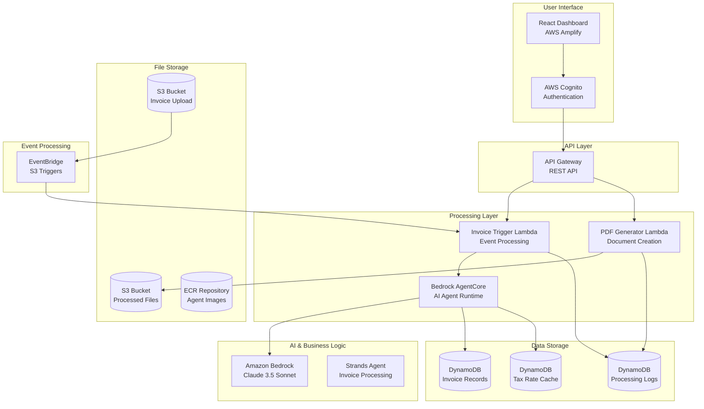
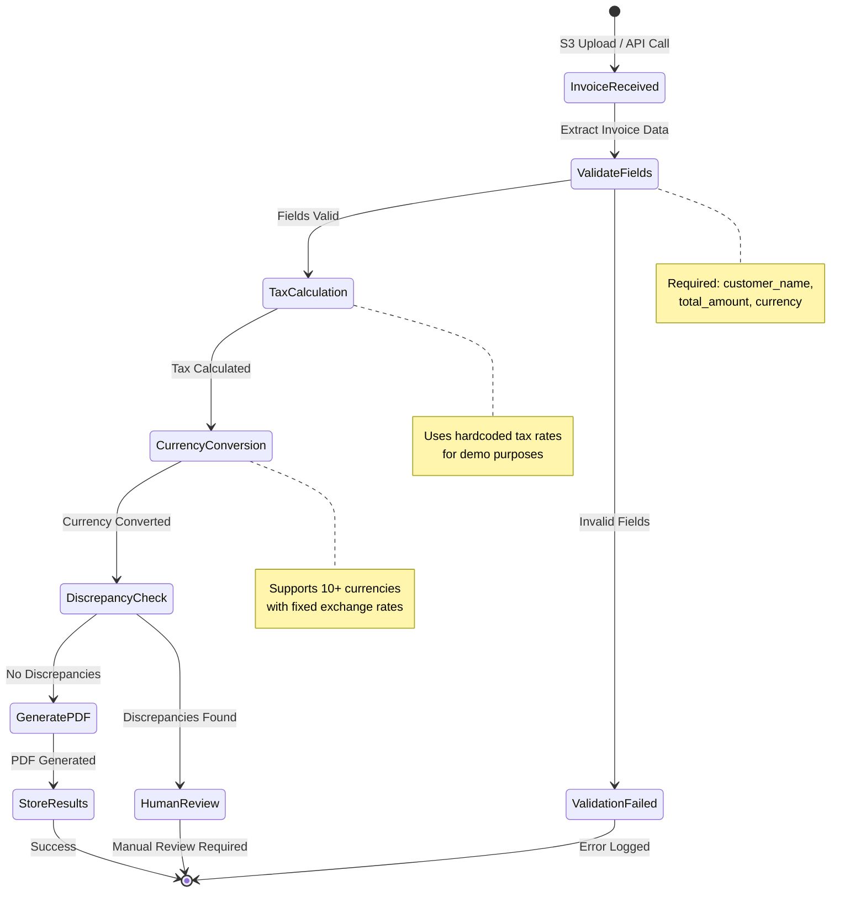
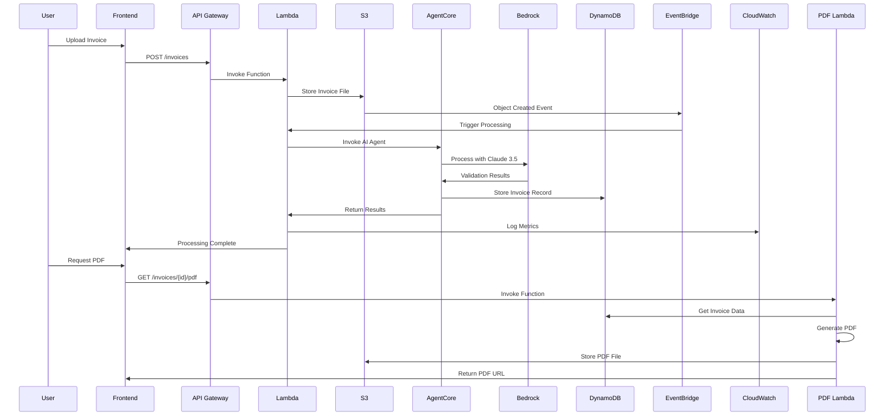

# GlobalInvoiceAI

GlobalInvoiceAI is an autonomous AI-powered global invoice management and validation system built on AWS serverless architecture. It automates vendor invoice processing, tax compliance calculations, currency conversions, and customer invoice generation using Amazon Bedrock AgentCore with the Strands framework.

## Architecture Overview



## Key Features

- **Autonomous AI Agent**: Intelligent invoice validation and processing using Amazon Bedrock AgentCore
- **Multi-Currency Support**: Currency conversion with hardcoded exchange rates for demo purposes
- **Tax Compliance**: Automated tax calculations for multiple regions including US state sales tax, UK VAT, and Indian GST
- **PDF Generation**: Professional invoice documents generated using ReportLab
- **Serverless Architecture**: Cost-effective deployment using AWS Lambda, API Gateway, and DynamoDB
- **Secure Authentication**: User management and access control via AWS Cognito
- **Real-time Monitoring**: Comprehensive logging and metrics through CloudWatch

## Supported Regions and Tax Systems

The system supports tax calculations for the following regions:

- **United States**: State-level sales tax (CA, NY, TX, FL)
- **United Kingdom**: Standard VAT (20%)
- **India**: GST (18%) with state variations (Maharashtra, Karnataka, Delhi)
- **Canada**: HST/GST/PST combinations (Ontario, British Columbia, Quebec)
- **Australia**: GST by state (NSW, Victoria, Queensland)
- **European Union**: Country-specific VAT rates (Germany, France, Italy, Spain, Netherlands)

## Technology Stack

### Core Infrastructure
- **Amazon Bedrock AgentCore**: Runtime environment for autonomous AI agents
- **Strands Framework**: Python framework for agent development and orchestration
- **Amazon Bedrock**: Claude 3.5 Sonnet foundation model for intelligent processing
- **AWS Lambda**: Serverless compute for invoice processing and PDF generation
- **Amazon S3**: Object storage for invoice files and generated documents
- **Amazon DynamoDB**: NoSQL database for invoice records, tax cache, and processing logs

### User Interface & Security
- **React**: Frontend application with modern JavaScript framework
- **AWS Amplify**: Hosting and deployment platform for web applications
- **AWS Cognito**: User authentication and authorization service
- **Amazon API Gateway**: RESTful API management and security
- **Amazon CloudWatch**: Monitoring, logging, and alerting

### Development Tools
- **ReportLab**: PDF document generation library
- **Boto3**: AWS SDK for Python
- **Bootstrap**: CSS framework for responsive UI components
- **Chart.js**: Data visualization library

## Infrastructure Components

```mermaid
graph TD
    subgraph "S3 Storage Layer"
        UploadBucket[Invoice Upload Bucket<br/>globalinvoiceai-invoice-upload-{env}]
        ProcessedBucket[Processed Invoices Bucket<br/>globalinvoiceai-processed-invoices-{env}]
        AgentCodeBucket[Agent Code Bucket<br/>globalinvoiceai-agent-code-{env}]
        AmplifySourceBucket[Amplify Source Bucket<br/>globalinvoiceai-amplify-source-{env}]
    end

    subgraph "DynamoDB Tables"
        Invoices[Invoices Table<br/>Primary Key: InvoiceId<br/>GSI: Status, CustomerId]
        TaxRates[Tax Rates Cache<br/>Primary Key: CountryRegion, TaxType<br/>TTL: 24h]
        ProcessingLogs[Processing Logs<br/>Primary Key: LogId<br/>GSI: InvoiceId, Timestamp<br/>TTL: 30d]
    end

    subgraph "Lambda Functions"
        InvoiceTrigger[Invoice Trigger Function<br/>Python 3.11, 256MB<br/>Timeout: 300s]
        PDFGenerator[PDF Generator Function<br/>Python 3.11, 512MB<br/>Timeout: 60s]
        AgentCoreDeploy[AgentCore Deploy Function<br/>Python 3.11, 512MB<br/>Timeout: 900s]
    end

    subgraph "Authentication"
        UserPool[Cognito User Pool<br/>Email-based authentication]
        UserPoolClient[User Pool Client<br/>SPA configuration]
        IdentityPool[Cognito Identity Pool<br/>IAM role assignment]
    end

    subgraph "API & Events"
        ApiGateway[API Gateway<br/>Regional deployment<br/>CORS enabled]
        EventBridgeRule[EventBridge Rule<br/>S3 object created events]
    end

    subgraph "Monitoring"
        CloudWatchDashboard[CloudWatch Dashboard<br/>Metrics visualization]
        CloudWatchLogs[CloudWatch Logs<br/>Function and API logs]
        CloudWatchAlarms[CloudWatch Alarms<br/>Error rate monitoring]
    end

    UploadBucket --> EventBridgeRule
    EventBridgeRule --> InvoiceTrigger
    InvoiceTrigger --> ApiGateway
    PDFGenerator --> ApiGateway
    InvoiceTrigger --> Invoices
    InvoiceTrigger --> TaxRates
    InvoiceTrigger --> ProcessingLogs
    PDFGenerator --> Invoices
    PDFGenerator --> ProcessingLogs
    PDFGenerator --> ProcessedBucket
    AgentCoreDeploy --> ECR
    UserPool --> UserPoolClient
    UserPoolClient --> IdentityPool
    InvoiceTrigger --> CloudWatchLogs
    PDFGenerator --> CloudWatchLogs
    CloudWatchLogs --> CloudWatchDashboard
```

## Agent Architecture



## Data Flow



## Quick Start

### Prerequisites

- AWS Account with appropriate permissions
- AWS CLI configured with credentials
- Node.js (v16+) for frontend development
- Python (v3.11+) for Lambda functions
- Git for repository cloning

### Deployment

1. **Clone Repository**
   ```bash
   git clone https://github.com/YOUR_USERNAME/GlobalInvoiceAI.git
   cd GlobalInvoiceAI
   ```

2. **Deploy Infrastructure**
   ```bash
   # Create deployment bucket
   aws s3 mb s3://globalinvoiceai-deployment-us-west-2-dev

   # Package and deploy CloudFormation stack
   aws cloudformation package \
     --template-file cloudformation/globalinvoiceai-stack.yaml \
     --s3-bucket globalinvoiceai-deployment-us-west-2-dev \
     --output-template-file packaged-template.yaml

   aws cloudformation deploy \
     --template-file packaged-template.yaml \
     --stack-name globalinvoiceai-dev \
     --parameter-overrides \
       Environment=dev \
       CognitoDomainPrefix=globalinvoiceai-dev-$(date +%s) \
       DeploymentArtifactsBucket=globalinvoiceai-deployment-us-west-2-dev \
     --capabilities CAPABILITY_IAM CAPABILITY_NAMED_IAM CAPABILITY_AUTO_EXPAND
   ```

3. **Configure Amplify Application**
   - Connect the Amplify app to your GitHub repository
   - Deploy the frontend application

4. **Create Admin User**
   ```bash
   # Get User Pool ID from CloudFormation outputs
   USER_POOL_ID=$(aws cloudformation describe-stacks \
     --stack-name globalinvoiceai-dev \
     --query 'Stacks[0].Outputs[?OutputKey==`UserPoolId`].OutputValue' \
     --output text)

   # Create admin user
   aws cognito-idp admin-create-user \
     --user-pool-id $USER_POOL_ID \
     --username admin@globalinvoiceai.com \
     --temporary-password TempPassword123!
   ```

## Testing

Test the system using provided sample invoice files:

- `sample-data/invoice-us.json` - US invoice with New York sales tax
- `sample-data/invoice-uk.json` - UK invoice with VAT
- `sample-data/invoice-india.json` - Indian invoice with GST

Upload these files through the web interface or S3 console to validate processing functionality.

## Security and Compliance

- **Data Encryption**: AES-256 encryption at rest and TLS 1.3 in transit
- **Access Control**: Least-privilege IAM roles and policies
- **Authentication**: JWT-based authentication with AWS Cognito
- **Audit Logging**: Complete processing activity logging
- **Network Security**: VPC deployment options for production environments

## Cost Optimization

**Development Environment (estimated monthly costs):**
- AWS Lambda: $0.50 (pay-per-invocation)
- Amazon Bedrock: $2.00 (pay-per-token)
- Amazon DynamoDB: $1.00 (on-demand pricing)
- Amazon S3: $0.10 (storage and requests)
- **Total: $3.60/month** (near-zero when idle)

**Production Scale (10,000 invoices/month):**
- AWS Lambda: $5.00
- Amazon Bedrock: $20.00
- Amazon DynamoDB: $10.00
- Amazon S3: $1.00
- **Total: $36.00/month**

## License

This project is licensed under the Creative Commons Attribution-NonCommercial 4.0 International License (CC BY-NC 4.0).

For commercial licensing inquiries, contact licensing@globalinvoiceai.com.

## Support

For technical support and questions:
- Create an issue in the GitHub repository
- Review the deployment documentation in `docs/DEPLOYMENT.md`
- Contact the development team at support@globalinvoiceai.com
